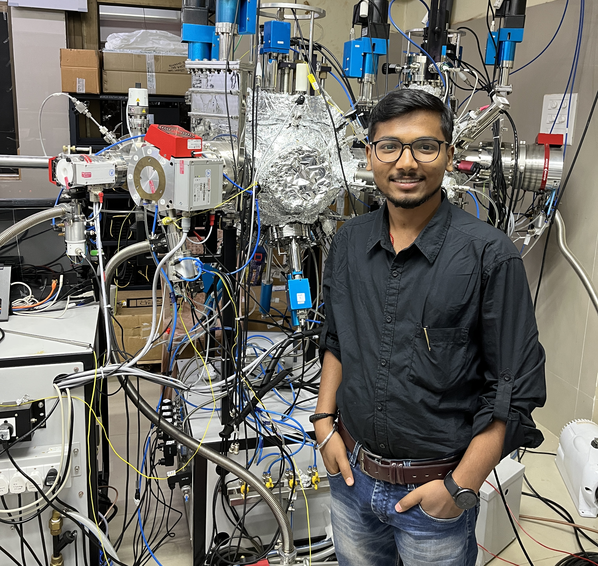

As a skilled Postdoctoral Researcher, I specialize in computational materials science, machine learning, and molecular dynamics.
My track record demonstrates research in energy materials, catalysis, and chemical reaction dynamics, alongside extensive
experience in teaching and collaborative research projects. As a team player, I seamlessly collaborate; as an individual worker,
I exhibit remarkable autonomy and effectiveness, epitomizing versatile productivity. I am currently seeking challenging opportunities 
in industrial research and development, leveraging my analytical prowess and soft skills to drive innovation and problem-solving.

# Experience 

#### Postdoctoral Research Associate at Technical University of Denmark (DTU) Energy with [Assoc. Prof. Heine A. Hansen](https://orbit.dtu.dk/en/persons/heine-anton-hansen){:target="_blank"}
* I utilize cutting-edge machine learning potentials to advance our understanding and development of energy materials
* Led team in creating a [CURATOR](https://github.com/Yangxinsix/curator) package that minimize the human effort to develop robust machine learning potential for energy materials
* Exploring the solid-liquid interface, particularly the interaction between gold and acetonitrile, utilizing machine learning potentials
* Collaborated with DTU scientists to investigate the ORR/OER reactions, advancing our understanding of energy materials
* Engaged with experimental scientists to investigate polymer degradation mechanisms using Density Functional Theory

#### Doctor of Philosophy at University College Dublin with [Prof. Niall J. English](https://people.ucd.ie/niall.english){:target="_blank"}
* Explored hydrogen storage and release mechanisms to enhance energy efficiency
* Investigated hydrogen production through water splitting for sustainable energy solutions
* Conducted research on dye-sensitized solar cells to optimize photovoltaic performance
* Collaborated with colleagues to explore interdisciplinary approaches in energy research
* Mentored master's and PhD students in conducting innovative research projects, fostering skills development and knowledge transfer

For a comprehensive overview of my academic and industrial experiences, please refer to the following documents:

* [Acadamic CV](assets/Yogesh_CV.pdf){:target="_blank"} Delve into my academic journey, research endeavors, and scholarly achievements
* [Industrial CV](assets/Yogesh_ICV.pdf){:target="_blank"} Explore my professional trajectory, industry engagements, and contributions to applied research and development
  
These documents offer detailed insights into my qualifications, accomplishments, and areas of expertise.

# Education

  - Post Doctoral Research, Technical University of Denmark, Lyngby, Denmark (Sep 2021 - May 2024)
  - Ph.D., University College Dublin, Dublin. Ireland (May 2021)
  - M.Sc. (Materials Science), PSG College of Technology, Coimbatore, Tamilnadu, India (May 2014)
  - B.Sc. (Physics), Sacred Heart College, Tirupattur, Tamilnadu, India (May 2012)
---------------------------------
 

<!-- 
comment out the unnecessary things
 -->

